# Task Manager

This project is a Task Management System built with Django, allowing users to manage tasks, assign workers, and track progress. 
It includes task, task type, member, member position and tag.
Also, it has custom authentication, and robust UI components.


## Getting started

1. Clone repository

```shell
git clone https://github.com/OleksiukStepan/task-manager.git
```

2. Create and activate .venv environment

```shell
python -m venv venv
```
on Windows
```shell
venv\Scripts\activate
```
on macOS
```shell
source venv/bin/activate
```

3. Install requirments.txt 

```shell
pip install -r requirements.txt
```

4. Make migrations

```shell
python manage.py makemigrations
python manage.py migrate
```

5. Load fixtures (Optional, but recommended)

```shell
python manage.py loaddata task_manager_fixtures.json
```

6. Create superuser

```shell
python manage.py createsuperuser
```

7. Run server

```shell
python manage.py runserver # http://127.0.0.1:8000/
```


## Features

Authentication:
* Login
* Log out
* Sign in

Task & Worker:
* Detail page
* Creating
* Updating
* Deleting
* Assigning worker for task

Task type, position, tags:
* Creating
* Deleting

Additional features:
* Sorting task by name, deadline, created, priority
* Dynamic creating tags, positions, task types
* Online status for workers
* Searching task and worker by name
* Dynamic showing profile while creating new member

## Demo

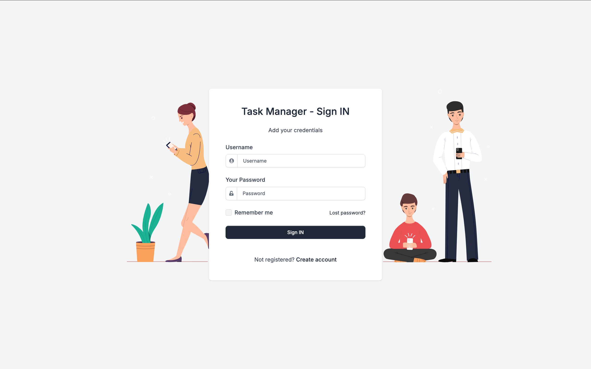
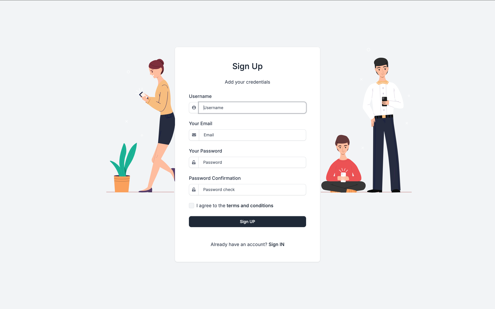
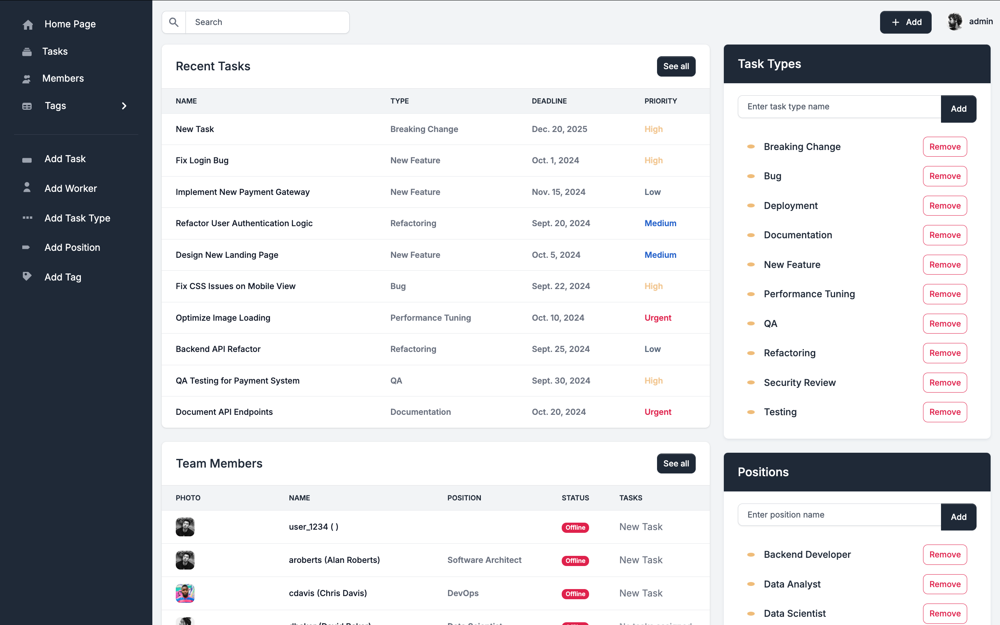
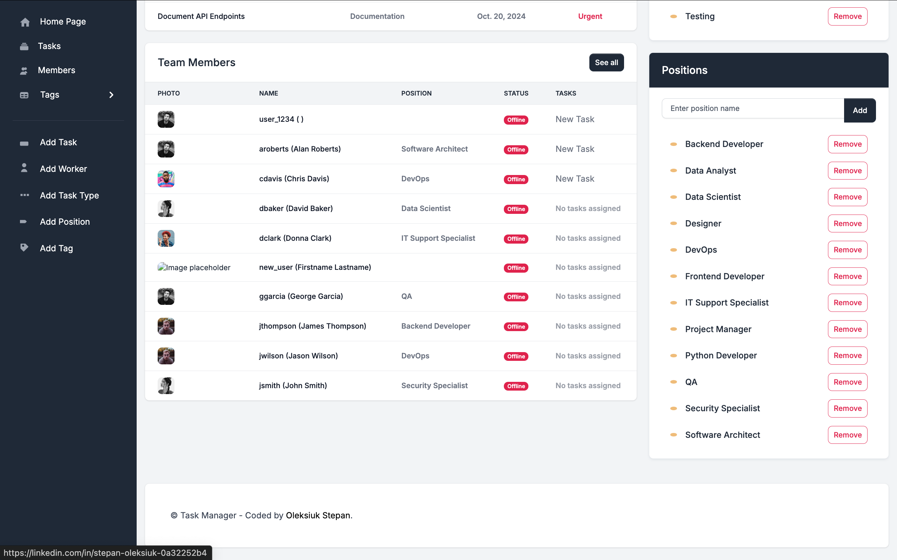
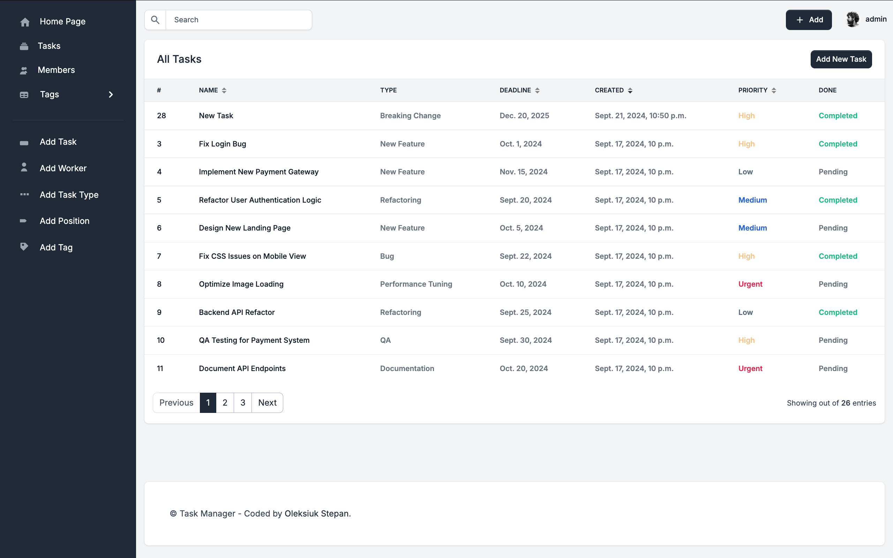
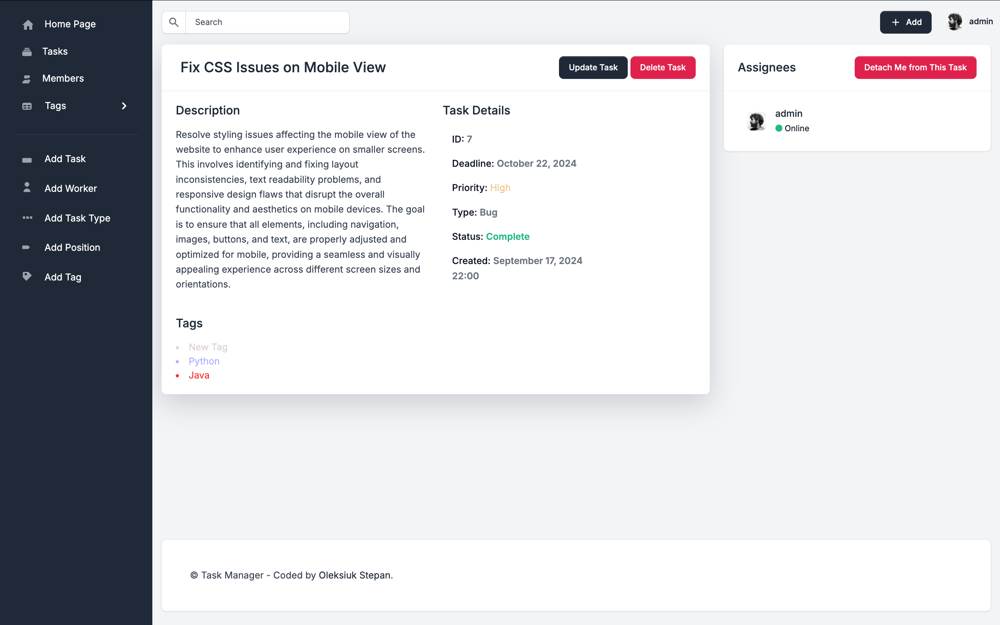
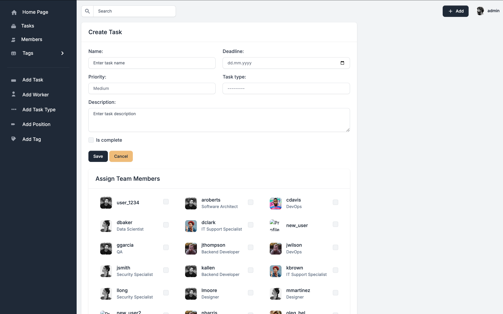
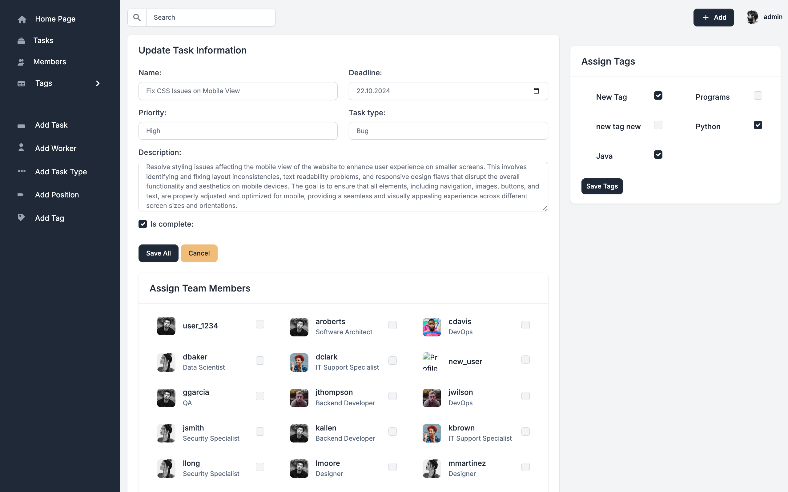
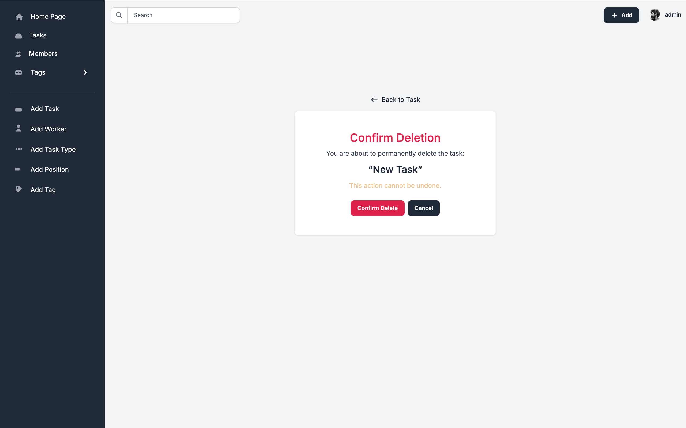
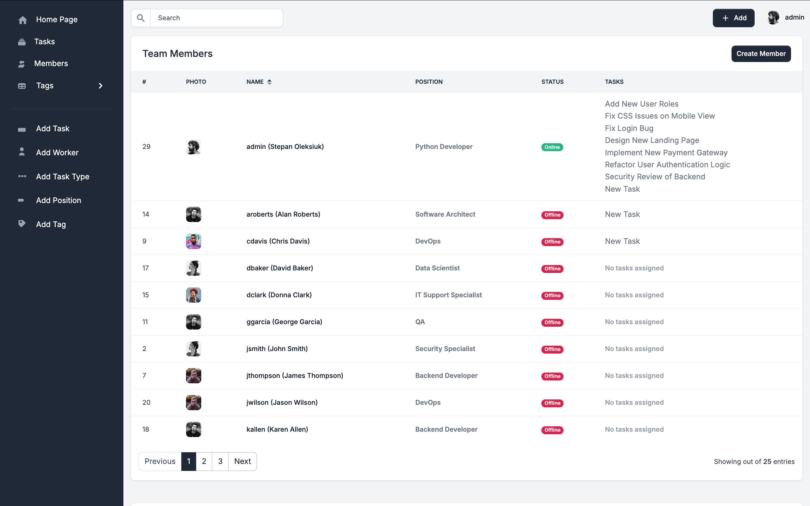
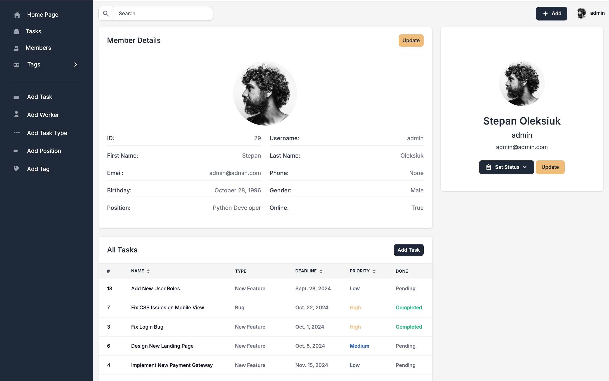
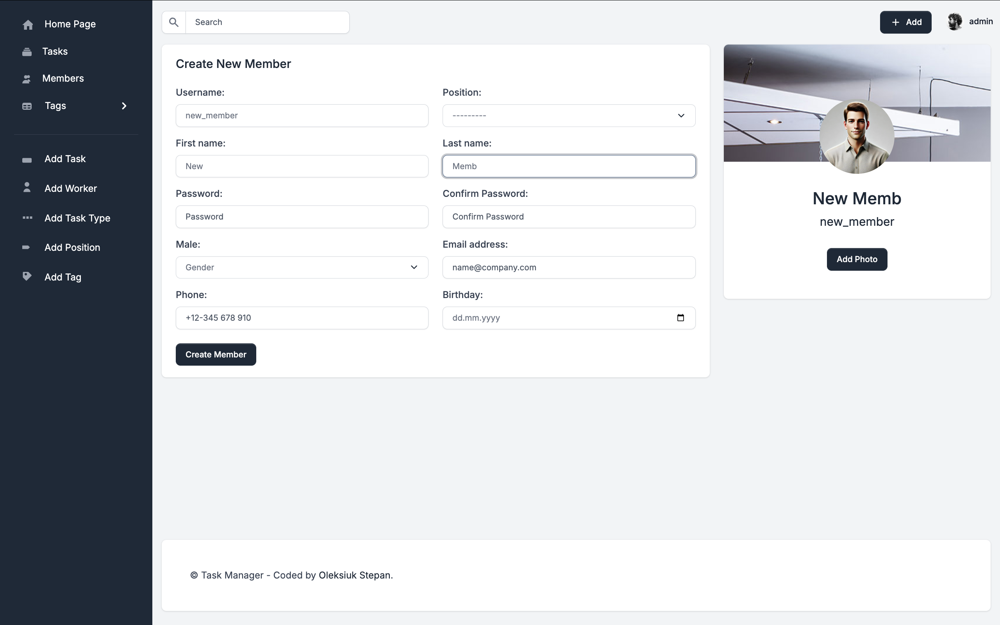
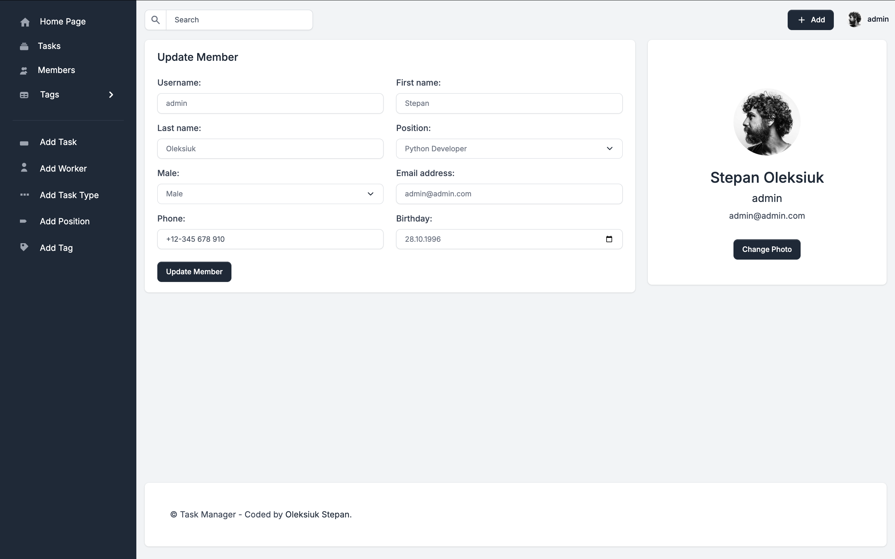
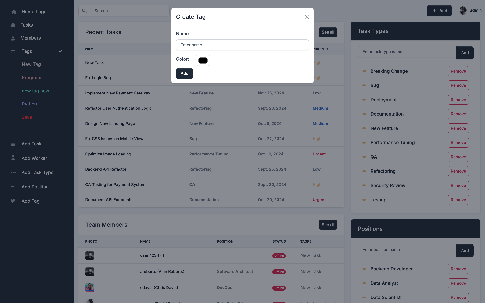
